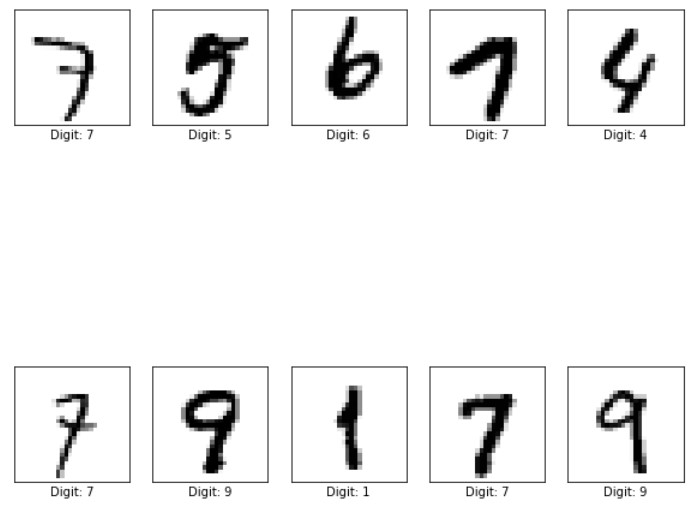
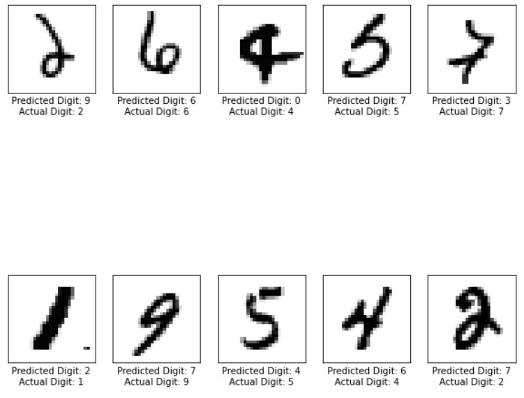
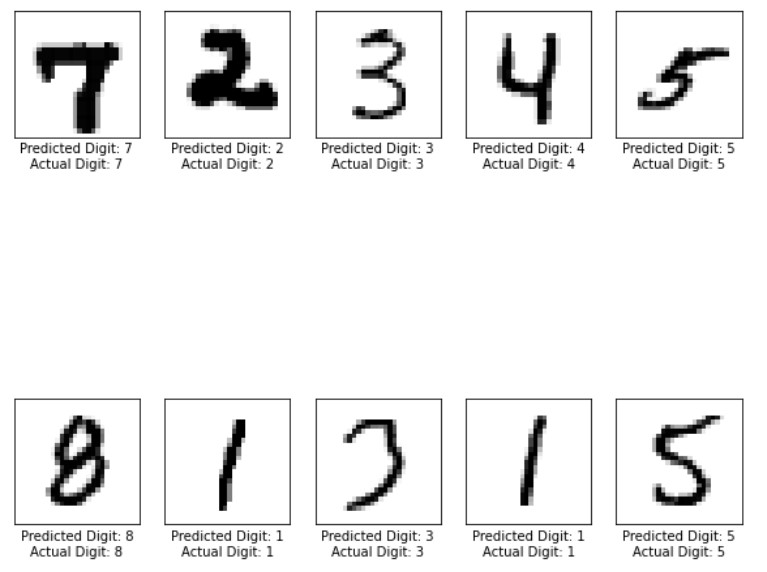

# Handwritten Digits Image Classification
## Scope
Classify handwritten digits using feedforward artificial neural network (ANN) and convolutional neural network (CNN) deep learning approaches.

## Example MNIST Dataset Visualization

## Results
| Approach     | Loss    | Accuracy |
| :------------- | :------------- | :------------- |
| ANN       | 0.0920       | 0.9744
| CNN       | 0.0399      | 0.9908 |

## Prediction Performance
#### ANN

#### CNN

